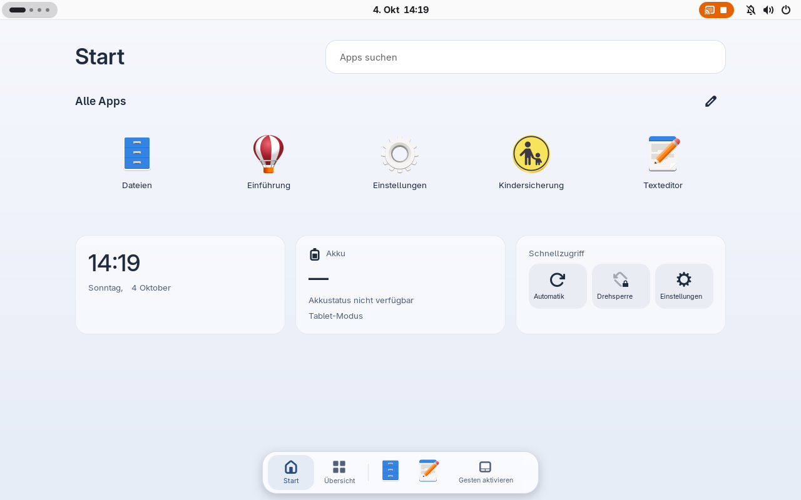
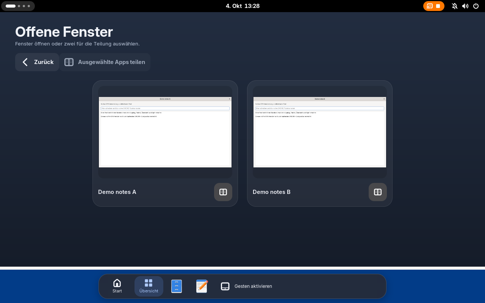

# convertibled

A native tablet workspace for Linux convertibles.

Fold your laptop and keep working: Home, application search, a floating dock,
live window previews and portrait-aware split view, integrated into GNOME Shell.
Native settings, hardware status and a project-owned installer and updater
complete the product.



*The actual GNOME Shell extension in the isolated native demo, shown in German.
Virtual hardware does not establish physical device support.*

**Experimental implementation. No supported public release is available yet.**
The first acceptance target is **Fedora 44 · GNOME 50 · Wayland · x86_64** on
**ThinkPad X1 Yoga Gen 8**. Other systems are not supported by the installer.
See [release gates](ROADMAP.md) for the remaining device and recovery checks.

## A desktop that fits folded use

- **Home and search:** launch applications, edit favorites and arrange local
  clock, battery and quick-action widgets.
- **Touch navigation:** a floating dock, visible Home/Overview controls and
  bottom-edge gestures after explicit touchscreen setup.
- **Your windows:** live previews and half/third/two-thirds split layouts,
  stacked vertically in portrait with application minimum sizes respected.
- **Native GNOME:** GTK4/libadwaita settings, light/dark appearance and
  German/English text. GNOME continues to own login, locking, notifications,
  the on-screen keyboard and display rotation.
- **Clear controls:** automatic or manual profiles, rotation lock, hardware
  capabilities and separate requested/applied status.
- **Owned lifecycle:** signed updates, preparation in the background,
  activation after logout, previous-version recovery and careful removal.

Home lives behind application windows. Folding preserves the focused app;
the Home button returns you to the workspace. External displays retain their
desktop behavior. Internal input suppression and automatic scaling remain off.
Automatic detection distinguishes laptop, folded and unknown; stand and tent
are manual profiles.



*Native demo overview with sample windows; appearance evidence, not touch or
performance acceptance. [Run the native demo](demo/README.md).*

## Get started

There is no public download to install today. Internal CI candidates are for
development and acceptance, and do not carry production release trust.

The project ships its own installer and signed release bundles. Start with
the [installation and first-run guide](docs/getting-started.md) for the
verified-installer procedure, platform requirements and onboarding. Production
trust must be established before installation; a development checkout alone
is not an installable trusted release.

Once installed, open **convertibled Settings**, or inspect your session:

```sh
convertiblectl status
convertiblectl capabilities
convertiblectl mode auto
```

Updates check and prepare automatically by default. **Settings → Updates**
shows the actual status and lets you change that preference. A prepared version
activates only after all affected graphical users log out; locking is not logout.
See [updates and removal](docs/getting-started.md#updates-and-removal) and
[troubleshooting](docs/troubleshooting.md).

## Build and contribute

The product uses Rust, GTK4/libadwaita and TypeScript/GJS. On a Linux development
host with the [required tools](docs/development.md#executable-development-checks):

```sh
cargo build --workspace --release --locked
cd extension
npm ci
npm run build
```

Building creates local artifacts; it does not install services or change GNOME.
Read [CONTRIBUTING.md](CONTRIBUTING.md) for checks, focused changes and useful
bug reports. [CI and releases](docs/releases.md) explains candidate artifacts,
signing and publication gates.

## Learn more

| Topic | Guide |
| --- | --- |
| Install, first login, updates and removal | [Getting started](docs/getting-started.md) |
| Missing sensors, workspace or updates | [Troubleshooting](docs/troubleshooting.md) |
| Profiles, configuration and CLI | [Configuration](docs/configuration.md) |
| Hardware and desktop acceptance | [Support](docs/support.md) |
| Product scope and remaining work | [Product](docs/product.md) · [Roadmap](ROADMAP.md) |
| Implementation and trust model | [Architecture](docs/architecture.md) · [Distribution](docs/distribution.md) |
| All specifications and implementation guides | [Documentation index](docs/README.md) |

Report vulnerabilities through [SECURITY.md](SECURITY.md).
Licensed under [MIT](LICENSE).
